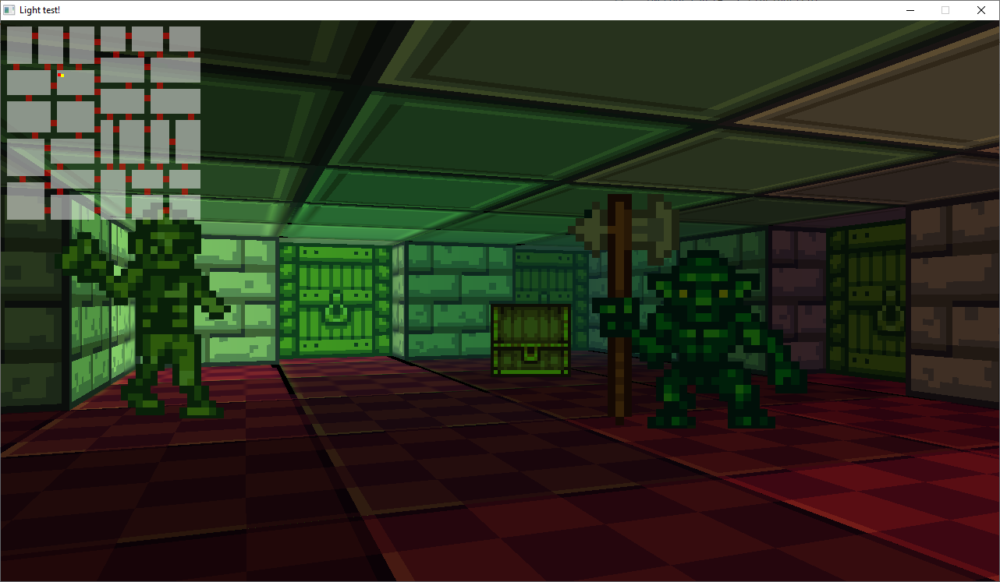

# Dungeon Crawler

A minimum dependency 3D roguelike game + engine. Highly WIP.

## Overview
This is a small sideproject game/engine thingy. I've learned a lot about c, cross platform development, OpenGL ES, math, Makefiles, Webassembly and embeddable scripting languages on the way. Core written in c. "High-Level"-abstractions and game logic written in wren. In the `game` folder you will find a WIP dungeon crawler I'm working on.

## Live Demo

[Play a live WASM demo here](https://alexklingenbeck.de/share/rogue/2020-08-02/main.html)




## Engine Features
* Emedded Wren script host
* Image loading
* Object-oriented low-level GLES2 graphics API
* c-backed JSON parser
* Low-level data access through "accessors"

## Dependencies

- ANGLE (on desktop for EGL + GLES 2.0 implementation)
- SDL2 (for Platform abstraction)

## Running

You can run the windows build using
```
./win32/main.exe
```
Make sure not to run it from the win32 directory directly as the game will look for the scripts folder

## Building
### Windows
I'm using MinGW32
```
mingw32-make main.exe
```
### Raspberry PI
```
make main
```
### WebAssembly
You'll need emscripten. Go to `make-web.sh` and adjust the variables to your environment. (Remove the reference to http-server if you don't need it). After that just run:

```
./make-web.sh
```

## Supported platforms

- Windows
- Raspberry PI
- WebAssembly

## Other platforms

This game should run on anything supporting GLES 2.0 or ANGLE and SDL2. I might extend this list in the future